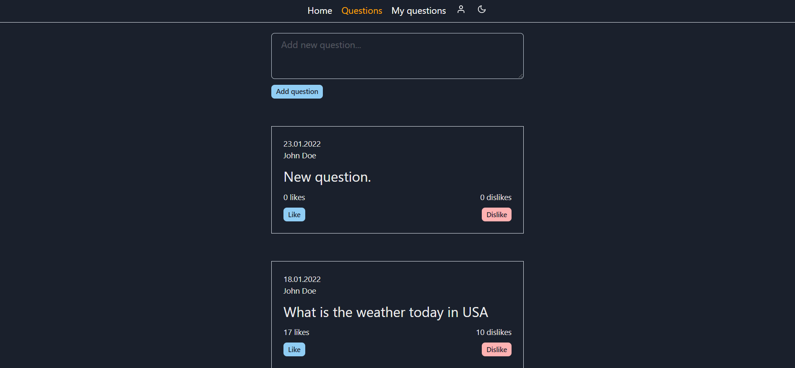

# ASK application client

[](https://cypress.io)



### `Getting started`

```
    git clone https://github.com/merima98/ASK-app-client.git
    cd ASK-app-client
    yarn install
    yarn start
```

## `Testing`

Project contains e2e(`cypress`) tests.

```
"cypress:open": "cypress open",
```
